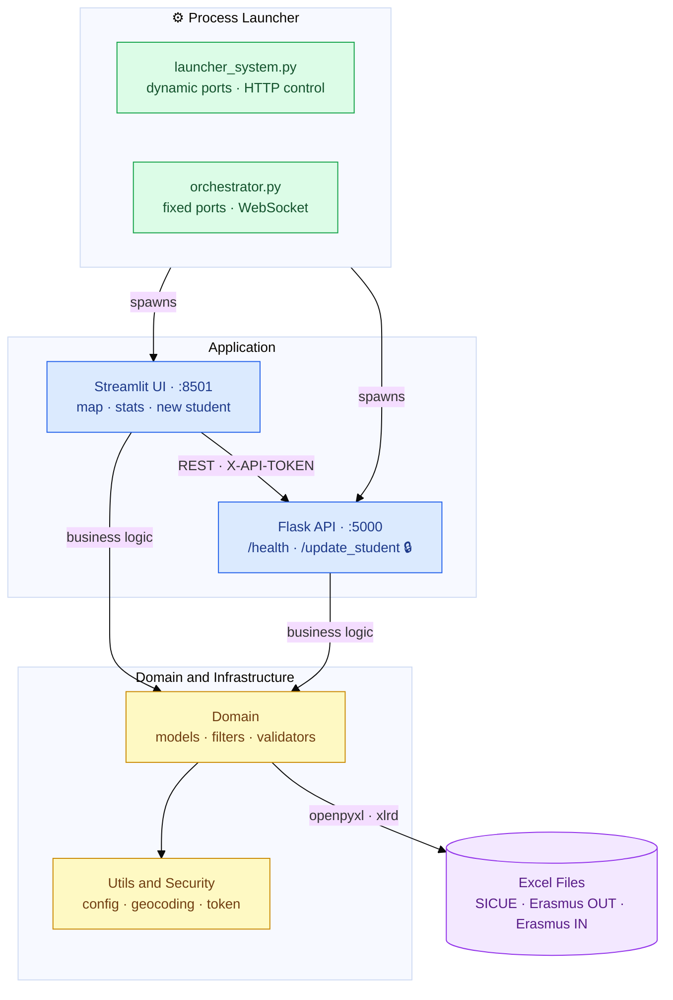

# Movilidad ESII

> Academic mobility management and visualisation tool (Erasmus OUT/IN, SICUE)  
> for the School of Computer Science Engineering (Albacete campus) - University of Castilla-La Mancha.

[](https://www.python.org/)
[](https://streamlit.io/)
[](https://flask.palletsprojects.com/)
[](https://www.microsoft.com/windows)
[](https://github.com/MariaPicazoSanchez/TFG-MariaPicazoSanchez/actions/workflows/build-installers.yml)
[](https://github.com/MariaPicazoSanchez/TFG-MariaPicazoSanchez/releases/latest)
[](https://creativecommons.org/licenses/by-nc/4.0/)

Windows desktop application that exposes a local web interface (Streamlit) backed by a REST microservice (Flask). All persistence is handled directly on the institution's existing Excel files — no additional database required.

---

## Preview

| Mapa interactivo | Búsqueda y filtros |
|:---:|:---:|
|  |  |

| Panel de estadísticas | Exportación a Excel |
|:---:|:---:|
|  |  |

---

## Table of Contents

1. [Process Architecture](#1-process-architecture)
2. [Repository Structure](#2-repository-structure)
3. [Configuration](#3-configuration)
4. [Development Setup](#4-development-setup)
5. [Running the Application](#5-running-the-application)
6. [REST API Reference](#6-rest-api-reference)
7. [Security Model](#7-security-model)
8. [Build & Distribution](#8-build--distribution)
9. [Windows SmartScreen Warning](#9-windows-smartscreen-warning)
10. [Licence](#10-licence)
11. [Author](#11-author)

---

## 1. Process Architecture

The project has **two independent launchers** that both start Streamlit + Flask, but differ in how they coordinate shutdown:

### System overview



### `launcher_system.py` — installer mode

```text
launcher_system.py
 ├── thread:     HTTP control server  (dynamic port)  — shutdown via /open /close /shutdown
 ├── subprocess: streamlit run install_root/web_app/my_app.py  → http://127.0.0.1:<port_A>
 └── subprocess: python   install_root/api/api.py              → http://127.0.0.1:<port_B>
```

Both application ports are allocated dynamically at startup via `pick_two_free_ports()` (OS-assigned, `socket.bind("127.0.0.1", 0)`), so they will differ between runs. The API port is passed to both subprocesses via the `API_PORT` environment variable.

A lightweight HTTP control server runs in a dedicated thread and handles coordinated shutdown when all browser tabs have been closed, via three internal endpoints: `/open`, `/close`, and `/shutdown`.

### `install_root/orchestrator/orchestrator.py` — development mode

```text
orchestrator.py
 ├── WebSocket server on ws://localhost:8765  — shutdown when browser tab closes
 ├── subprocess: streamlit run install_root/web_app/my_app.py  → http://127.0.0.1:8501  (default)
 └── subprocess: python   install_root/api/api.py              → http://127.0.0.1:5000  (default)
```

The orchestrator uses the default Streamlit and Flask ports (no dynamic allocation). The Streamlit app connects to the WebSocket server on load; when the browser tab is closed the connection drops, the orchestrator kills both child processes and exits cleanly.

Both launchers read `config.json` at startup to resolve the absolute paths of the Excel data files.

---

## 2. Repository Structure

```text
TFG-MariaPicazoSanchez/
├── launcher_system.py           # Unified launcher — pass --demo for demo mode
├── config.json                  # Excel file paths per mobility programme
├── installer.iss                # Inno Setup script (demo build — bundles sample data, passes --demo)
├── installer_sindata.iss        # Inno Setup script (production build — no data bundled)
├── MovilidadESII.spec           # PyInstaller spec file
└── install_root/
    ├── orchestrator/
    │   └── orchestrator.py      # Process manager — spawns Flask + Streamlit, shuts both down when the browser tab closes (WebSocket signal)
    ├── api/
    │   └── api.py               # Flask microservice (see §6)
    ├── web_app/
    │   └── my_app.py            # Streamlit entry point — view routing
    ├── constants.py             # Global constants (programme names, Excel columns, …)
    ├── requirements.txt         # Pinned Python dependencies
    ├── domain/
    │   ├── models.py            # Dataclasses: Student, University, Mobility, …
    │   ├── map_filters.py       # Filter logic for the map view
    │   ├── stats_filters.py     # Filter logic for the statistics view
    │   ├── validators.py        # Form field validation
    │   └── es_cities.py         # Static catalogue of Spanish cities
    ├── persistence/
    │   ├── data_access_mobility.py  # Excel → DataFrame readers (xlrd + openpyxl)
    │   ├── data_insert.py           # New row insertion into Excel
    │   ├── excel_update.py          # In-place row update (openpyxl)
    │   ├── materias_in_loader.py    # Erasmus IN subject-sheet loader
    │   └── sheets_helpers.py        # Sheet utilities: header detection, range helpers, …
    ├── export/
    │   ├── map_export.py        # Map PNG/SVG export
    │   └── stats_export.py      # Statistics export to .xlsx
    ├── ui/
    │   ├── map_view.py          # Interactive map view (Folium + streamlit-folium)
    │   ├── stats_view.py        # Statistics view (Altair / st.bar_chart)
    │   ├── sidebar.py           # Filter sidebar
    │   ├── popup_helpers.py     # Map popup HTML generation
    │   ├── popup_materias.py    # Erasmus IN subject-editing popup
    │   ├── popup_templates.py   # Jinja2 popup templates
    │   ├── search_helpers.py    # Sidebar autocomplete and search
    │   ├── stats_helpers.py     # Metric computation for the statistics view
    │   ├── stats_table.py       # Paginated results table
    │   ├── stats_details.py     # Per-row statistics detail panel
    │   ├── new_user_view.py     # New student registration form
    │   └── styles.py            # CSS injected into Streamlit
    ├── utils/
    │   ├── app_config.py        # config.json reader and validator
    │   ├── map_processing.py    # Internal geocoding and GeoJSON builder
    │   └── file_opener.py       # OS-level file opener
    ├── security/
    │   └── token_manager.py     # API token generation and persistence
    ├── static/
    │   └── materias_editor.js   # Subject-editor JS (served by Flask)
    └── data_demo/               # Sample data (bundled in the demo installer)
```

---

## 3. Configuration

`config.json` maps each mobility programme key to the absolute path of its Excel file. It is located either at the repository root (development) or at `%LOCALAPPDATA%\MovilidadESII\` (installed build).

```jsonc
{
  "SICUE OUT":   "<absolute path to SICUE outgoing .xlsx>",
  "Erasmus OUT": "<absolute path to Erasmus outgoing .xlsx>",
  "Erasmus IN":  "<absolute path to Erasmus incoming .xlsx>",
  "Materias IN": "<absolute path to Erasmus IN subjects .xlsx>"
}
```

Path resolution is handled by `utils/app_config.py`.

### Environment variables

| Variable | Default | Description |
|:---|:---|:---|
| `APP_CONFIG_PATH` | `config.json` | Override the config file location |
| `API_HOST` | `127.0.0.1` | Flask API bind address |
| `API_PORT` | *(dynamic)* | Flask API port — set automatically by `launcher_system.py`; in orchestrator/manual mode defaults to `5000` |

---

## 4. Development Setup

**Prerequisites:** Python 3.12, pip.

```bash
git clone https://github.com/MariaPicazoSanchez/TFG-MariaPicazoSanchez
cd TFG-MariaPicazoSanchez

python -m venv .venv
.venv\Scripts\activate

pip install -r install_root/requirements.txt
```

### Key dependencies

| Package | Version | Purpose |
|:---|:---|:---|
| `streamlit` | 1.47.1 | Web UI framework |
| `flask` | 3.1.2 | REST API server |
| `flask-cors` | 6.0.1 | Cross-origin support for embedded iframes |
| `websockets` | 16.0 | WebSocket server in the orchestrator (shutdown signal) |
| `psutil` | 7.2.2 | Process-tree kill in the orchestrator |
| `folium` | 0.20.0 | Interactive HTML map generation |
| `streamlit-folium` | 0.25.3 | Folium embed in Streamlit |
| `pandas` | 2.2.3 | In-memory DataFrame processing |
| `openpyxl` | 3.1.5 | `.xlsx` read/write |
| `xlrd` | 2.0.2 | Legacy `.xls` read |
| `altair` | 5.5.0 | Declarative chart generation |
| `babel` | 2.16.0 | Locale-aware country/city name formatting |
| `pycountry` | 24.6.1 | ISO country and language code lookups |
| `geopy` | 2.4.1 | Geocoding — city/country coordinates |
| `jinja2` | 3.1.6 | HTML templating for map popups |
| `jsonschema` | 4.26.0 | JSON Schema validation |


### Offline wheelhouse

```bash
py -3.12 -m pip download -r install_root/requirements.txt -d wheelhouse --only-binary=:all:
```

> The `wheelhouse/` directory is excluded from version control via `.gitignore` and can be deleted after generating the installer.

---

## 5. Running the Application

### Recommended mode — Orchestrator

```bash
py install_root/orchestrator/orchestrator.py
```

Or from inside `install_root/`:

```bash
cd install_root
set APP_CONFIG_PATH=..\config.json
python orchestrator/orchestrator.py
```

Starts Streamlit (`http://127.0.0.1:8501`) and Flask (`http://127.0.0.1:5000`) automatically. Closing the browser tab shuts down both processes cleanly via the WebSocket signal.

### Legacy mode — `launcher_system.py`

```bash
py launcher_system.py
```

Starts Streamlit and Flask with dynamically assigned ports and coordinates shutdown via an internal HTTP control server. Used mainly for the desktop installer build.

### Manual mode (individual processes)

Useful for debugging a single component in isolation:

```bash
# Terminal 1 — Flask API
cd install_root
set APP_CONFIG_PATH=..\.config.json
python api/api.py
# → http://127.0.0.1:5000

# Terminal 2 — Streamlit UI
cd install_root
python -m streamlit run web_app/my_app.py
# → http://localhost:8501
```

> **Note:** In manual mode the WebSocket server is not active, so closing the browser will not stop the processes. Stop them manually with `Ctrl+C`.

---

## 6. REST API Reference

**Base URL:** `http://127.0.0.1:<API_PORT>`

The port is dynamically allocated by `launcher_system.py`. In orchestrator or manual dev mode it defaults to `5000` unless overridden by `API_PORT`.

Write endpoints require the `X-API-TOKEN` header (see [§7 Security Model](#7-security-model)). The token is also accepted as a `token` query parameter for form-based submissions.

### Endpoints

| Method | Path | Auth | Description |
|:---|:---|:---:|:---|
| `GET` | `/health` | — | Liveness check. Returns `{"ok": true}`. |
| `POST` | `/update_student` | ✔ | Updates a student record in the corresponding Excel file. |

### `POST /update_student`

**Content-Type:** `multipart/form-data`

| Field | Type | Required | Description |
|:---|:---|:---:|:---|
| `programa` | string | ✔ | Programme key: `"Erasmus OUT"`, `"Erasmus IN"`, or `"SICUE OUT"` |
| `excel_path` | string | ✔ | Path to the Excel file (overridden by `config.json` value when present) |
| `row_index` | string | ✔ | DataFrame row index (0-based, as string) |
| `idx` | string | ✔ | Student index within the `estudiantes` cell |
| `estudiante` | string | ✔ | Student full name |
| `email` | string | | Student email |
| `ciudad` | string | | Destination city |
| `pais` | string | | Destination country |
| `old_email` | string | | Previous email (used to locate the row on update) |
| `old_nombre` | string | | Previous name |
| `materias_raw` | string | | JSON array of subjects: `[{"nombre":"…","cuat":"1","firmado":true}, …]` |

**Response:** `text/html` with an embedded `<script>` that calls `window.parent.postMessage` with the operation result.

**Error codes:**

| Status | Meaning |
|:---|:---|
| `401` | Missing or invalid `X-API-TOKEN` |
| `200` + `{"ok": false}` | Excel file locked, path not found, or invalid indices |

---

## 7. Security Model

All write operations are protected by a per-installation bearer token:

- `security/token_manager.py` generates a cryptographically random 64-character hex token on first run (`secrets.token_hex(32)`) and persists it to `security/.api_token`.
- On each startup `api.py` loads the token from that file and validates every protected request against the `X-API-TOKEN` header.
- `security/.api_token` is listed in `.gitignore` and is never committed to the repository.

---

## 8. Build & Distribution

Installers are produced by the **`Build EXE and Installers`** GitHub Actions workflow (`.github/workflows/`), triggered manually via `workflow_dispatch`. The workflow runs on `windows-latest` and produces two artifacts in `output/`.

### Pipeline overview

| Stage | Tool | Output |
|:---|:---|:---|
| Checkout repository | `actions/checkout@v4` | — |
| Setup Python | `actions/setup-python@v5` (Python 3.12) | — |
| Install dependencies | `pip install pyinstaller -r install_root/requirements.txt` | — |
| Build wheelhouse | `pip wheel -r install_root/requirements.txt -w install_root/wheelhouse` | `install_root/wheelhouse/` |
| Install Inno Setup | `choco install innosetup` | — |
| Build EXE | `python -m PyInstaller --onedir --noconsole --clean --noconfirm --icon=install_root/MovilidadESII.ico --name MovilidadESII launcher_system.py` | `dist/MovilidadESII/` |
| Build installer — demo | `ISCC.exe installer.iss` | `output/MovilidadESII_Installer_ConData.exe` |
| Build installer — production | `ISCC.exe installer_sindata.iss` | `output/MovilidadESII_Installer_SinData.exe` |
| Clean `dist/` + `build/` + `*.spec` | `Remove-Item -Recurse -Force` | — |
| Decode certificate | Recover `.pfx` from `CERTIFICATE_PFX` secret (Base64) | — |
| Sign installers | `signtool.exe` — Authenticode-signs both `.exe` artefacts with `CERTIFICATE_PASSWORD` | Signed `.exe` files |
| Generate SHA256 hashes | `certutil -hashfile` — computes SHA256 for both installers | `output/SHA256.txt` |
| Clean certificate | Delete decoded `.pfx` from runner | — |
| Upload artifact — demo | `actions/upload-artifact@v4` | GitHub Actions artifact `installer-demo` |
| Upload artifact — production | `actions/upload-artifact@v4` | GitHub Actions artifact `installer-clean` |

### Triggering a build

Go to **Actions → Build EXE and Installers → Run workflow** in the GitHub UI. Once complete, the installers are published automatically as a new GitHub Release and are available from the [Releases page](https://github.com/MariaPicazoSanchez/TFG-MariaPicazoSanchez/releases/latest).

| File | Description |
|:---|:---|
| `MovilidadESII_Installer_ConData.exe` | Includes sample data for demonstration |
| `MovilidadESII_Installer_SinData.exe` | Production build — no data bundled |
| `SHA256.txt` | SHA256 checksums for both installers |

### Verifying the download

Each release includes a `SHA256.txt` file with the checksums for both installers.
To verify the integrity of a downloaded file, run the following command in PowerShell or Command Prompt:

```powershell
certutil -hashfile MovilidadESII_Installer_ConData.exe SHA256
```

Compare the output with the corresponding entry in `SHA256.txt`. If they match, the file is intact and has not been modified.

### What the installer does

- Copies `dist/MovilidadESII/` to `%LOCALAPPDATA%\MovilidadESII\`.
- Creates a desktop shortcut and a Start Menu entry.
- Writes `config.json` to `%LOCALAPPDATA%\MovilidadESII\` with the correct data paths.
- Does not require Python to be installed on the target machine.

---

## 9. Windows SmartScreen Warning

The installers are **Authenticode-signed** with a self-signed certificate (`Maria Picazo Sanchez - TFG`, valid 5 years). Signing is applied automatically on every CI build; no manual step is required. The certificate is embedded directly in the `.exe`, so Windows correctly identifies the publisher as **Maria Picazo Sanchez - TFG** instead of *Unknown Publisher*.

> **The application is safe to run.** Source code and build pipeline are fully auditable in this repository.

### Why SmartScreen may still warn

A warning may still appear for two independent reasons:

- **Untrusted root.** The certificate is self-signed — not issued by a commercial CA (DigiCert, Sectigo, etc.) and not chained to any root that Windows trusts by default.
- **No accumulated reputation.** SmartScreen also scores how many users have downloaded and run a given binary. A newly published file starts with zero reputation regardless of its signature.

This is expected behaviour for academic projects and does not indicate any threat.

### Resolving the warning

**Option A — Unblock via file Properties** *(recommended)*

1. Download the `.exe` file. **Do not run it yet.**
2. Open the folder where the file was saved.
3. Right-click the file → **Properties**.
4. In the **General** tab, scroll to the very bottom. If Windows flagged the file as downloaded from the internet you will see:

   ```
   ⚠ This file came from another computer and might be
     blocked to help protect this computer.

     ☐ Unblock
   ```

5. Check the **Unblock** checkbox → **Apply** → **OK**.
6. You can now run the installer.

> If the *Unblock* checkbox is absent, the file was already unblocked or downloaded in a way that did not trigger the internet zone mark. No action needed.

**Option B — Trust the certificate permanently**

Install the public part of the certificate (`.cer`) into **Trusted Publishers** on the local machine (right-click → **Install Certificate** → **Local Machine** → **Trusted Publishers**). Any executable signed with this certificate will be silently trusted on that machine from then on.

---

## 10. Licence

This project is released under the **Creative Commons Attribution-NonCommercial 4.0 International (CC BY-NC 4.0)** license. You are free to use, share, and adapt this work for non-commercial purposes with attribution. Commercial use requires explicit written permission from the author. See [`LICENSE`](LICENSE) for details.

---

## 11. Author

**María Picazo Sánchez**  
Grado en Ingeniería Informática — Escuela Superior de Ingeniería Informática en el campus de Albacete (ESIIAB)  
Universidad de Castilla-La Mancha · Curso 2025–2026
