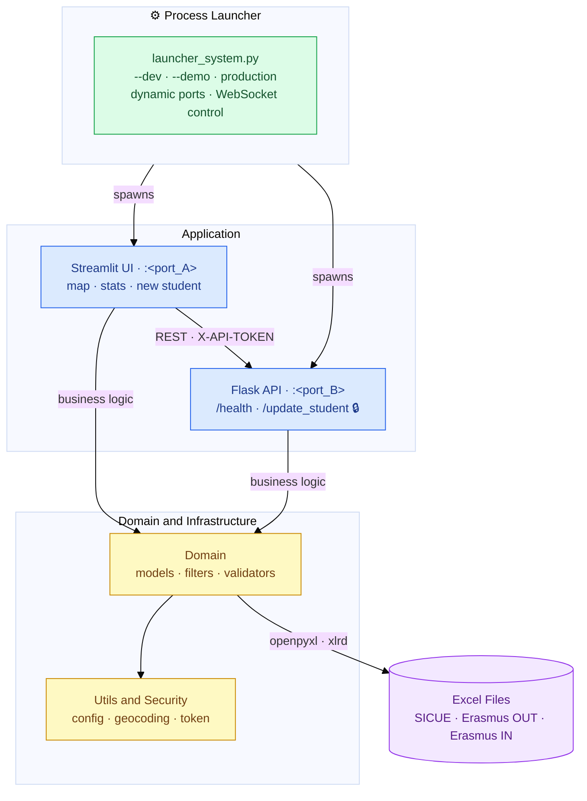

# Movilidad ESII

> Academic mobility management and visualisation tool (Erasmus OUT/IN, SICUE)  
> for the School of Computer Science Engineering (Albacete campus) - University of Castilla-La Mancha.

[](https://www.python.org/)
[](https://streamlit.io/)
[](https://flask.palletsprojects.com/)
[](https://www.microsoft.com/windows)
[](https://github.com/MariaPicazoSanchez/TFG-MariaPicazoSanchez/actions/workflows/build-installers.yml)
[](https://github.com/MariaPicazoSanchez/TFG-MariaPicazoSanchez/actions/workflows/tests.yml)
[](https://github.com/MariaPicazoSanchez/TFG-MariaPicazoSanchez/actions/workflows/lint.yml)
[](https://github.com/MariaPicazoSanchez/TFG-MariaPicazoSanchez/releases/latest)
[](https://apps.microsoft.com/detail/9PBHCL7R9QNV?hl=es-es&gl=ES&ocid=pdpshare)
[](https://creativecommons.org/licenses/by-nc/4.0/)

Windows desktop application that exposes a local web interface (Streamlit) backed by a REST microservice (Flask). All persistence is handled directly on the institution's existing Excel files — no additional database required.

---

## Preview

| Mapa interactivo | Búsqueda y filtros |
|:---:|:---:|
|  |  |

| Panel de estadísticas | Exportación a Excel |
|:---:|:---:|
|  |  |

---

## Table of Contents

1. [Process Architecture](#1-process-architecture)
2. [Repository Structure](#2-repository-structure)
3. [Configuration](#3-configuration)
4. [Development Setup](#4-development-setup)
5. [Running the Application](#5-running-the-application)
6. [Testing](#6-testing)
7. [REST API Reference](#7-rest-api-reference)
8. [Security Model](#8-security-model)
9. [Build & Distribution](#9-build--distribution)
10. [Windows SmartScreen Warning](#10-windows-smartscreen-warning)
11. [Microsoft Store (MSIX)](#11-microsoft-store-msix)
12. [Licence](#12-licence)
13. [Author](#13-author)

---

## 1. Process Architecture

`launcher_system.py` is the **single unified launcher** for all modes. It starts Streamlit + Flask, allocates ports dynamically, and coordinates shutdown via a WebSocket control server.

### System overview



### `launcher_system.py`

```text
launcher_system.py [--dev | --demo]
 ├── thread (asyncio):  WebSocket control server  (dynamic port)  — shutdown when browser tab closes
 ├── subprocess: streamlit run install_root/web_app/my_app.py  → http://127.0.0.1:<port_A>
 └── subprocess: python   install_root/api/api.py              → http://127.0.0.1:<port_B>
```

All ports are allocated dynamically at startup via `pick_two_free_ports()` (OS-assigned, `socket.bind("127.0.0.1", 0)`), so they will differ between runs. The API port is passed to both subprocesses via the `API_PORT` environment variable; the WebSocket control port is passed as `WS_PORT`.

The Streamlit app connects to the WebSocket server on load. When the browser tab is closed the connection drops; after a short grace period (to absorb F5 reloads) the launcher kills both child processes and exits cleanly.

| Flag | Behaviour |
|:---|:---|
| *(none)* | Production mode — uses embedded/system Python, single-instance lock, AppData paths |
| `--demo` | Production mode with sample data bundled by the installer |
| `--dev` | Development mode — uses the running Python directly, skips installation checks and instance lock |

`config.json` is read at startup to resolve the absolute paths of the Excel data files.

---

## 2. Repository Structure

```text
TFG-MariaPicazoSanchez/
├── launcher_system.py           # Unified launcher — --dev · --demo · production
├── config.json                  # Excel file paths per mobility programme
├── installer.iss                # Inno Setup script (demo build — bundles sample data, passes --demo)
├── installer_sindata.iss        # Inno Setup script (production build — no data bundled)
├── requirements-dev.txt         # Development dependencies (includes pytest)
├── pytest.ini                   # pytest configuration
├── tests/                       # Unit tests (pytest)
│   ├── conftest.py              # Path setup and streamlit mocks
│   ├── test_converters.py       # Tests for domain/_converters.py
│   ├── test_validators.py       # Tests for domain/_validator_rules.py
│   └── test_map_processing.py  # Tests for utils/map_processing.py
└── install_root/
    ├── api/
    │   └── api.py               # Flask microservice (see §7)
    ├── web_app/
    │   └── my_app.py            # Streamlit entry point — view routing
    ├── constants.py             # Global constants (programme names, Excel columns, …)
    ├── requirements.txt         # Pinned Python dependencies
    ├── domain/
    │   ├── models.py            # Column definitions and programme constants
    │   ├── map_filters.py       # Filter logic for the map view
    │   ├── stats_filters.py     # Filter logic for the statistics view
    │   ├── validators.py        # DataValidator orchestrator and schemas
    │   ├── _converters.py       # Type converters and normalizers
    │   ├── _validator_rules.py  # Individual validator factories
    │   └── es_cities.py         # Static catalogue of Spanish cities
    ├── persistence/
    │   ├── data_insert.py           # New row insertion into Excel
    │   ├── excel_update.py          # In-place row update (openpyxl)
    │   ├── materias_in_loader.py    # Erasmus IN subject-sheet loader
    │   ├── _excel_cells.py          # Cell-level helpers (geocoding, field aliases)
    │   ├── _excel_tables.py         # Table/header detection utilities
    │   ├── _insert_helpers.py       # Column lookup helpers
    │   ├── _insert_row_builders.py  # Row dict builders per programme type
    │   └── loaders/
    │       ├── all_dataframes.py    # Loads all programmes into DataFrames
    │       ├── erasmus_in.py        # Erasmus IN loader
    │       ├── erasmus_out.py       # Erasmus OUT loader
    │       ├── sicue_out.py         # SICUE OUT loader
    │       └── _common.py           # Shared loader utilities
    ├── export/
    │   └── stats_export.py      # Statistics export to .xlsx
    ├── ui/
    │   ├── map_view.py          # Interactive map view (Folium + streamlit-folium)
    │   ├── stats_view.py        # Statistics view (Altair / st.bar_chart)
    │   ├── sidebar.py           # Filter sidebar
    │   ├── _sidebar_config.py   # Config I/O and file-picker helpers
    │   ├── popup_materias.py    # Erasmus IN subject-editing popup
    │   ├── popup_templates.py   # Map popup HTML generation
    │   ├── search_helpers.py    # Sidebar autocomplete and search
    │   ├── stats_helpers.py     # Metric computation for the statistics view
    │   ├── stats_table.py       # Paginated results table
    │   ├── stats_details.py     # Per-row statistics detail panel
    │   ├── styles.py            # CSS injected into Streamlit
    │   └── new_user/
    │       ├── view.py          # New student registration form (orchestrator)
    │       ├── _form_in.py      # Erasmus IN sub-form
    │       ├── _form_out.py     # Erasmus OUT sub-form
    │       ├── _form_sicue.py   # SICUE OUT sub-form
    │       └── _helpers.py      # Shared helpers (geocoding, catalogue, country map)
    ├── utils/
    │   ├── app_config.py        # config.json reader, session defaults
    │   ├── map_processing.py    # Zoom bounds, DataFrame checks, LA filtering
    │   └── file_opener.py       # OS-level file opener
    ├── security/
    │   └── token_manager.py     # API token generation and persistence
    ├── static/
    │   └── materias_editor.js   # Subject-editor JS (served by Flask)
    └── data_demo/               # Sample data (bundled in the demo installer)
```

---

## 3. Configuration

`config.json` maps each mobility programme key to the absolute path of its Excel file. It is located either at the repository root (development) or at `%LOCALAPPDATA%\MovilidadESII\` (installed build).

```jsonc
{
  "SICUE OUT":   "<absolute path to SICUE outgoing .xlsx>",
  "Erasmus OUT": "<absolute path to Erasmus outgoing .xlsx>",
  "Erasmus IN":  "<absolute path to Erasmus incoming .xlsx>",
}
```

Path resolution is handled by `utils/app_config.py`.

### Environment variables

| Variable | Default | Description |
|:---|:---|:---|
| `APP_CONFIG_PATH` | `config.json` | Override the config file location |
| `API_HOST` | `127.0.0.1` | Flask API bind address |
| `API_PORT` | *(dynamic)* | Flask API port — set automatically by the launcher; defaults to `5000` in manual mode |
| `WS_PORT` | *(dynamic)* | WebSocket control server port — set automatically by the launcher |

---

## 4. Development Setup

**Prerequisites:** Python 3.12, pip.

```bash
git clone https://github.com/MariaPicazoSanchez/TFG-MariaPicazoSanchez
cd TFG-MariaPicazoSanchez

python -m venv .venv
.venv\Scripts\activate

pip install -r install_root/requirements.txt
```

For development (includes pytest):

```bash
pip install -r requirements-dev.txt
```

### Key dependencies

| Package | Version | Purpose |
|:---|:---|:---|
| `streamlit` | 1.47.1 | Web UI framework |
| `flask` | 3.1.2 | REST API server |
| `flask-cors` | 6.0.1 | Cross-origin support for embedded iframes |
| `websockets` | 16.0 | WebSocket control server in the launcher (shutdown signal) |
| `folium` | 0.20.0 | Interactive HTML map generation |
| `streamlit-folium` | 0.25.3 | Folium embed in Streamlit |
| `pandas` | 2.2.3 | In-memory DataFrame processing |
| `openpyxl` | 3.1.5 | `.xlsx` read/write |
| `xlrd` | 2.0.2 | Legacy `.xls` read |
| `altair` | 5.5.0 | Declarative chart generation |
| `babel` | 2.16.0 | Locale-aware country/city name formatting |
| `pycountry` | 24.6.1 | ISO country and language code lookups |
| `geopy` | 2.4.1 | Geocoding — city/country coordinates |
| `jinja2` | 3.1.6 | HTML templating for map popups |
| `jsonschema` | 4.26.0 | JSON Schema validation |
| `pywebview` | 5.0.5 | Native desktop window wrapping the Streamlit web UI |
| `pystray` | 0.19.5 | System tray icon — minimise-to-tray and restore |
| `psutil` | 7.2.2 | Process tree termination on shutdown |


### Offline wheelhouse

```bash
py -3.12 -m pip download -r install_root/requirements.txt -d wheelhouse --only-binary=:all:
```

> The `wheelhouse/` directory is excluded from version control via `.gitignore` and can be deleted after generating the installer.

---

## 5. Running the Application

### Development mode

```bash
py launcher_system.py --dev
```

Uses the Python interpreter that is already active (no embedded runtime lookup), skips the single-instance lock and installation checks. Ports are assigned dynamically. Closing the browser tab shuts down both processes cleanly via the WebSocket signal.

### Production / installer mode

```bash
py launcher_system.py          # production
py launcher_system.py --demo   # demo (uses sample data bundled by the installer)
```

Resolves the embedded or system Python, acquires a single-instance lock, verifies dependencies, and starts the app. Used by the desktop installer shortcut.

### Manual mode (individual processes)

Useful for debugging a single component in isolation:

```bash
# Terminal 1 — Flask API
cd install_root
set APP_CONFIG_PATH=..\.config.json
python api/api.py
# → http://127.0.0.1:5000

# Terminal 2 — Streamlit UI
cd install_root
python -m streamlit run web_app/my_app.py
# → http://localhost:8501
```

> **Note:** In manual mode the WebSocket server is not active, so closing the browser will not stop the processes. Stop them manually with `Ctrl+C`.

---

## 6. Testing

The test suite covers the core domain logic and data processing utilities. Tests run without launching the Streamlit or Flask processes — all UI dependencies are mocked automatically.

With the venv active (see [§4](#4-development-setup)):

```bash
pytest -v
```

| Test file | Module under test | Tests |
|:---|:---|:---:|
| `tests/test_converters.py` | `domain/_converters.py` — type converters and normalizers | 44 |
| `tests/test_validators.py` | `domain/_validator_rules.py` — individual validator factories | 49 |
| `tests/test_map_processing.py` | `utils/map_processing.py` — zoom bounds, LA filtering | 35 |

Tests also run automatically on every push and pull request to `main` via the **Tests** GitHub Actions workflow.

---

## 7. REST API Reference

**Base URL:** `http://127.0.0.1:<API_PORT>`

The port is dynamically allocated by the launcher. In manual mode it defaults to `5000` unless overridden by the `API_PORT` environment variable.

Write endpoints require the `X-API-TOKEN` header (see [§8 Security Model](#8-security-model)). The token is also accepted as a `token` query parameter for form-based submissions.

### Endpoints

| Method | Path | Auth | Description |
|:---|:---|:---:|:---|
| `GET` | `/health` | — | Liveness check. Returns `{"ok": true}`. |
| `POST` | `/update_student` | ✔ | Updates a student record in the corresponding Excel file. |

### `POST /update_student`

**Content-Type:** `multipart/form-data`

| Field | Type | Required | Description |
|:---|:---|:---:|:---|
| `programa` | string | ✔ | Programme key: `"Erasmus OUT"`, `"Erasmus IN"`, or `"SICUE OUT"` |
| `excel_path` | string | ✔ | Path to the Excel file (overridden by `config.json` value when present) |
| `row_index` | string | ✔ | DataFrame row index (0-based, as string) |
| `idx` | string | ✔ | Student index within the `estudiantes` cell |
| `estudiante` | string | ✔ | Student full name |
| `email` | string | | Student email |
| `ciudad` | string | | Destination city |
| `pais` | string | | Destination country |
| `old_email` | string | | Previous email (used to locate the row on update) |
| `old_nombre` | string | | Previous name |
| `materias_raw` | string | | JSON array of subjects: `[{"nombre":"…","cuat":"1","firmado":true}, …]` |

**Response:** `text/html` with an embedded `<script>` that calls `window.parent.postMessage` with the operation result.

**Error codes:**

| Status | Meaning |
|:---|:---|
| `401` | Missing or invalid `X-API-TOKEN` |
| `200` + `{"ok": false}` | Excel file locked, path not found, or invalid indices |

---

## 8. Security Model

All write operations are protected by a per-installation bearer token:

- `security/token_manager.py` generates a cryptographically random 64-character hex token on first run (`secrets.token_hex(32)`) and persists it to `security/.api_token`.
- On each startup `api.py` loads the token from that file and validates every protected request against the `X-API-TOKEN` header.
- `security/.api_token` is listed in `.gitignore` and is never committed to the repository.

---

## 9. Build & Distribution

The project has **two independent distribution channels**, each with its own GitHub Actions workflow:

| Channel | Workflow | Output |
|:---|:---|:---|
| **GitHub Releases** (EXE installers) | `build-installers.yml` | `.exe` + `.zip` via Inno Setup |
| **Microsoft Store** (MSIX) | `build-msix.yml` | `.msix` native package (clean build, no demo data) |

Both workflows are triggered manually via `workflow_dispatch`.

---

### Channel A — GitHub Releases (Inno Setup EXE installers)

Workflow: `.github/workflows/build-installers.yml`  
Trigger: **Actions → Build EXE and Installers → Run workflow** — input the version tag (e.g. `v1.2.0`).

| Stage | Tool | Output |
|:---|:---|:---|
| Checkout + Python 3.12 | `actions/checkout`, `actions/setup-python` | — |
| Install dependencies + build wheelhouse | `pip install`, `pip wheel` | `install_root/wheelhouse/` |
| Install Inno Setup | `choco install innosetup` | — |
| Build EXE (PyInstaller) | `python -m PyInstaller --onedir --noconsole` | `dist/MovilidadESII/` |
| Build installer — demo | `ISCC.exe installer.iss` | `output/MovilidadESII_Installer_ConData.exe` |
| Build installer — production | `ISCC.exe installer_sindata.iss` | `output/MovilidadESII_Installer_SinData.exe` |
| Rename + zip + SHA256 | `Compress-Archive`, `certutil -hashfile` | Versioned `.exe`, `.zip`, `SHA256.txt` |
| Create GitHub Release | `softprops/action-gh-release@v2` | Published release with all artefacts |

Once complete the installers are available from the [Releases page](https://github.com/MariaPicazoSanchez/TFG-MariaPicazoSanchez/releases/latest).

| File | Description |
|:---|:---|
| `MovilidadESII_ConData_<version>.exe` | Includes sample data for demonstration |
| `MovilidadESII_SinData_<version>.exe` | Production build — no data bundled |
| `SHA256.txt` | SHA256 checksums for both installers and ZIP archives |

#### Verifying the download

```powershell
certutil -hashfile MovilidadESII_SinData_v1.2.0.exe SHA256
```

Compare the output with the corresponding entry in `SHA256.txt`.

#### What the EXE installer does

- Copies `dist/MovilidadESII/` to `%LOCALAPPDATA%\MovilidadESII\`.
- Extracts a pre-configured embedded Python runtime to `%LOCALAPPDATA%\MovilidadESII\runtime\python\`.
- Creates a desktop shortcut and a Start Menu entry.
- Writes `config.json` to `%LOCALAPPDATA%\MovilidadESII\`.
- Does not require Python to be installed on the target machine.
- Creates `.installer_complete` marker on success so the launcher skips dependency checks at startup.

> **SmartScreen warning:** EXE installers distributed outside the Store are not signed with a commercial CA certificate, so Windows will show an *Unknown Publisher* warning. See [§10](#10-windows-smartscreen-warning) for the unblock procedure. Installing from the Microsoft Store avoids this entirely.

---

### Channel B — Microsoft Store (native MSIX)

Workflow: `.github/workflows/build-msix.yml`  
Trigger: **Actions → Build MSIX (Microsoft Store) → Run workflow** — input the version tag.

This workflow builds a **native MSIX package** entirely from source — it does not wrap the EXE installer. The MSIX is signed locally with a self-signed certificate only for packaging purposes; Microsoft re-signs it with its own certificate when the submission is approved, so no EV certificate is required.

| Stage | Tool | Output |
|:---|:---|:---|
| Checkout + Python 3.12 | `actions/checkout`, `actions/setup-python` | — |
| Install dependencies + build wheelhouse | `pip install`, `pip wheel` | `install_root/wheelhouse/` |
| Build EXE (PyInstaller) | `python -m PyInstaller --onedir --noconsole` | `dist/MovilidadESII/` |
| Prepare embedded Python | Download embed ZIP → enable site-packages → pre-install all packages offline | `embedded_python/` |
| Generate PNG assets from ICO | `System.Drawing` (PowerShell) | `msix_assets/*.png` |
| Build MSIX layout | Copy exe + app code + runtime into `msix_layout/` | `msix_layout/` |
| Generate `AppxManifest.xml` | PowerShell string generation | `msix_layout/AppxManifest.xml` |
| Pack MSIX | `makeappx pack` (Windows SDK) | `output_msix/MovilidadESII_SinData_<version>.msix` |
| Self-sign | `New-SelfSignedCertificate` + `signtool sign` | Locally signed MSIX |
| Upload artifact | `actions/upload-artifact@v4` | `MSIX-SinData-<version>` |

#### MSIX layout

```text
msix_layout/
├── AppxManifest.xml
├── Assets/
│   ├── Square44x44Logo.png
│   ├── Square150x150Logo.png
│   └── StoreLogo.png
├── MovilidadESII.exe        ← launcher (PyInstaller)
├── _internal/               ← PyInstaller dependencies
├── app/                     ← Python source (web_app/, api/, domain/, …)
└── runtime/
    └── python/              ← Python 3.12 embedded, fully pre-configured
```

#### Required repository secrets

| Secret | Description |
|:---|:---|
| `MSSTORE_PUBLISHER_ID` | Publisher identity from Partner Center — e.g. `CN=XXXX` |
| `MSSTORE_PACKAGE_NAME` | Package name registered in Partner Center — e.g. `MaraPicazoSnchez.MovilidadESII` |
| `MSSTORE_PUBLISHER_DISPLAY_NAME` | Display name shown in the Store listing |

Set these under **Settings → Secrets and variables → Actions → Repository secrets**.

#### Submitting to Partner Center

1. Run the workflow and download the `MSIX-SinData-<version>` artifact.
2. In [Partner Center](https://partner.microsoft.com/), open the app submission → **Packages** → upload the `.msix` file.
3. If the `runFullTrust` restricted capability warning appears, go to **App management → Product policies → Declare restricted capability** and provide a justification (e.g. *"Desktop app built with PyInstaller; requires Full Trust to spawn Python subprocesses for Streamlit and Flask"*). Microsoft typically approves this for native desktop tools.
4. If a version conflict appears (*two packages with the same full name*), increment the version (e.g. from `v1.1.0` to `v1.2.0`) and rebuild — the new package will have a different `PackageFullName` and can coexist.

---

## 10. Windows SmartScreen Warning

This applies **only to EXE installers downloaded from GitHub Releases**. Installers obtained through the **Microsoft Store are signed by Microsoft** and will never trigger SmartScreen.

The EXE installers distributed via GitHub Releases are signed with a self-signed certificate (not issued by a commercial CA), so Windows will display them as *Unknown Publisher*. This is expected behaviour for academic projects without a commercial code-signing certificate.

> **The application is safe to run.** Source code and build pipeline are fully auditable in this repository.

### Why SmartScreen warns

- **No commercial CA signature.** Without an Authenticode certificate from a recognised authority, the installer appears as *Unknown Publisher*.
- **No accumulated reputation.** SmartScreen also scores how many users have run a given binary. A newly published file starts with zero reputation.

### Resolving the warning

1. Download the `.exe` file. **Do not run it yet.**
2. Open the folder where the file was saved.
3. Right-click the file → **Properties**.
4. In the **General** tab, scroll to the bottom. If Windows flagged the file as downloaded from the internet you will see:

   ```
   ⚠ This file came from another computer and might be
     blocked to help protect this computer.

     ☐ Unblock
   ```

5. Check the **Unblock** checkbox → **Apply** → **OK**.
6. You can now run the installer.

> If the *Unblock* checkbox is absent, the file was already unblocked or downloaded in a way that did not trigger the internet zone mark. No action needed.

To suppress the warning permanently for EXE installers, a commercial EV (Extended Validation) certificate from a recognised CA (DigiCert, Sectigo, etc.) would be required. For the Microsoft Store distribution channel this is unnecessary — Microsoft re-signs the MSIX during the certification process.

---

## 11. Microsoft Store (MSIX)

The application is **published on the [Microsoft Store](https://apps.microsoft.com/detail/9PBHCL7R9QNV?hl=es-es&gl=ES&ocid=pdpshare)** as a native MSIX package (see [§9 — Channel B](#channel-b--microsoft-store-native-msix)).

### Advantages over the EXE installer

| | EXE (GitHub Releases) | MSIX (Microsoft Store) |
|:---|:---:|:---:|
| No SmartScreen warning | ✗ | ✔ |
| Automatic updates | ✗ | ✔ |
| Clean uninstall | ✗ | ✔ |
| Embedded Python runtime | ✔ | ✔ |
| Demo data variant | ✔ | ✗ |

### Certification status

The application has been **accepted in Microsoft Partner Center**. Microsoft certification checks the following policies; all three were resolved in the current build:

| Policy | Requirement | Resolution |
|:---|:---|:---|
| 10.2.5 | No installer-in-MSIX — only native packages allowed | Workflow builds from source; no Inno Setup EXE is wrapped |
| 10.1.2.10 | App must not load indefinitely after launch | Launcher detects MSIX install and skips dependency checks at startup |
| 10.1.1.11 | Start Menu shortcut names must be unique | `AppxManifest.xml` sets `ShortName="MovilidadESII"` on the tile |

The `runFullTrust` restricted capability — required because the launcher spawns Python subprocesses (Streamlit and Flask) — was also approved by Microsoft, completing the certification.

---

## 12. Licence

This project is released under the **Creative Commons Attribution-NonCommercial 4.0 International (CC BY-NC 4.0)** license. You are free to use, share, and adapt this work for non-commercial purposes with attribution. Commercial use requires explicit written permission from the author. See [`LICENSE`](LICENSE) for details.

---

## 13. Author

**María Picazo Sánchez**  
Grado en Ingeniería Informática — Escuela Superior de Ingeniería Informática en el campus de Albacete (ESIIAB)  
Universidad de Castilla-La Mancha · Curso 2025–2026
